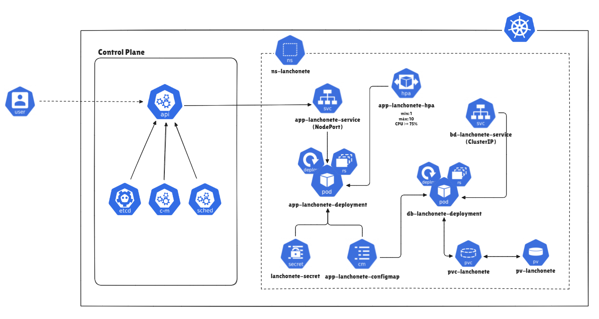

# PosTech - Software Architecture
### Projeto relacionado ao Tech Challenge fornecido como atividade avaliativa do curso de pós graduação em Arquitetura de Software da FIAP.  

*******
Sumário
- [Objetivos](#objetivos)
- [Requisitos do Tech Challenge](#requisitos-do-tech-challenge)
  - [Entregáveis Fase 1](#entregáveis-fase-1)
  - [Entregáveis Fase 2](#entregáveis-fase-2)
- [Passo a passo para build da aplicação localmente](#passo-a-passo-para-build-da-aplicação-localmente)
- [Passo a passo para build da aplicação em container Docker](#passo-a-passo-para-build-da-aplicação-em-container-docker)
- [Passo a passo para build da aplicação no cluster Kubernetes](#passo-a-passo-para-build-da-aplicação-no-cluster-kubernetes)
  - [Desenho da Arquitetura do Cluster Kubernetes](#desenho-da-arquitetura-do-cluster-kubernetes)

*******

# Objetivos
O objetivo principal desse projeto está em aprimorar as habilidades do grupo na construção de arquiteturas de software robustas e escaláveis. 
Baseando-se no desenvolvimento de uma aplicação que simula o funcionamento de uma lanchonete, aplico princípios fundamentais de design de software, como separação de responsabilidades, alta coesão e baixo acoplamento.</br> 
Além disso, o projeto nos permitiu aprofundar na orquestração de containers e microserviços, utilizando Docker e Kubernetes, tecnologias essenciais para arquiteturas modernas. O foco é consolidar práticas que garantam eficiência, manutenibilidade e escalabilidade, pilares de uma arquitetura bem projetada, com o intuito de me preparar para desafios mais complexos no papel de Arquiteto de Software.

# Requisitos do Tech Challenge
## Entregáveis Fase 1
Para a fase 1, foi solicitado o desenvolvimento de um sistema monolito, utilizando a arquitetura hexagonal + DDD, cujas responsabilidades eram executar as seguintes funcionalidades:
- Cadastro do cliente e identificação via CPF;
- Criar, buscar, editar e remover produtos;
- Buscar produtos por categoria;
- Criar pedidos simulando um fake checkout;
- Listar os pedidos.

Além disso, foi necessário realizar a criação dos arquivos Dockerfile e docker-compose.yaml para realizar o build da nossa aplicação e banco de dados em containers no Docker.

## Entregáveis Fase 2
Para a fase 2, foi necessário realizar a refatoração do código, incluindo novas funcionalidades e regras de negócio, além da implementação da Clean Architeture, conforme aprendido nas aulas da PosTech.</br>
As features adicionadas nessa fase 2 foram:
- Criação da API responsável por atualizar o status do pedido;
- Ordenação dos pedidos por status, horário do pedido e a não listagem dos pedidos finalizados;
- Por fim, a substituição do fake checkout, realizado na etapa anterior, por um webhook de pagamento, onde ao receber as informações, o mesmo seria responsável por atualizar o status do pedido.
  - Obs: Para o webhook, resolvemos aceitar o desafio adicionar e implementamos o webhook do mercado pago
  - Link: https://www.mercadopago.com.br/developers/pt/docs/your-integrations/notifications/webhooks

Em relação à infraestrutura, ao invés de subirmos nossa aplicação e banco de dados em containes Docker, dessa vez foi necessário criarmos alguns arquivos de configuração (.yaml), para que pudéssemos deployar a nossa aplicação em um cluster Kubernetes.

---

#### Observação:
Antes de seguir com o passo a passo de execução do serviço, vale ressaltar que, para todas as formas de execução da aplicação, será necessário realizar o clone do projeto (passo 1), para que possa ser realizado o build local, Docker ou em um cluster Kubernetes.

---
## Passo a passo para build da aplicação localmente

1. Clone o projeto na sua máquina </br>
**Certifique-se ter o git instalado em sua máquina e execute o comando abaixo pelo terminal:**  
``git clone https://github.com/HenriqueSaKi/fiap-tech-challenge-8soat.git``

2. Instale as dependências:</br>
   ``mvn clean install``

3. Inclua as variáveis de ambiente relacionados ao banco de dados na sua IDE. </br>
      ```
      DATASOURCE_URL=
      DATASOURCE_USERNAME=
      DATASOURCE_PASSWORD=
      DATASOURCE_DRIVER_CLASS_NAME=
      ```

   **Observação:** Caso não tenha uma preferência de banco de dados, recomendo utilizar o banco de dados H2.
   <details>
     <summary>Explicação de como utilizar o H2, clique para expandir.</summary>

   O primeiro passo para configurarmos o banco será adicionar a dependência do H2 no arquivo pom.xml
     ``` XML
     <dependency>
        <groupId>com.h2database</groupId>
        <artifactId>h2</artifactId>
        <scope>runtime</scope>
     </dependency>
  
     ```

   Feito isso, podemos alterar nosso arquivo application.yml, com as informações padrões do H2.
     ``` YAML
     spring:
        application:
           name: tech-challenge
        datasource:
           url: ${DATASOURCE_URL:jdbc:h2:mem:testdb}
           username: ${DATASOURCE_USERNAME:sa}
           password: ${DATASOURCE_PASSWORD:password}
           driverClassName: ${DATASOURCE_DRIVER_CLASS_NAME:org.h2.Driver}
     ```
   **Observação:** Mantendo as configurações dessa forma, você permite que por padrão o banco de dados utilizado seja o H2. No entanto, caso você informe na sua IDE as variáveis de ambiente de acordo com o banco de dados de sua preferência e incluir as dependências necessárias, você poderá utilizar inúmeras opções de banco de dados relacional.

   Por fim, podemos habilitar a visualização do console do H2 adicionando a seguinte configuração:
     ``` YAML
     spring:
        h2:
           console:
              enabled: true
              path: /h2-console
     ```

   **Observação:** Após subir sua aplicação com o banco de dados H2, você poderá acessar o console do banco de dados através desse link: http://localhost:8080/api/v1/h2-console

  </details>

4. Tudo pronto, só dar um <i>Run</i> :arrow_forward: na aplicação!
5. Acesse o Swagger da aplicação, pelo link abaixo</br>
   http://localhost:8080/api/v1/swagger-ui/index.html
---
## Passo a passo para build da aplicação em container Docker
1. Clone o projeto na sua máquina </br>
   **Certifique-se ter o git instalado em sua máquina e execute o comando abaixo pelo terminal:**  
   ``git clone https://github.com/HenriqueSaKi/fiap-tech-challenge-8soat.git``

2. Crie as imagens e suba os containeres</br>
   **Acesse a pasta raiz do projeto e execute os comandos abaixo:**

      ```sh
      # Crie as imagens docker, utilizando as configurações definidas no docker-compose
      # Obs: Utilize --no-cache, na frente do comando, 
      # caso queira garantir que a imagem será gerada do zero.
      docker-compose build
      
      # Suba os containeres
      docker-compose up -d
      
      # Confira se os containeres foram iniciados corretamente
      # O status deve estar 'Up'
      docker-compose ps -a
      ```

3. Acesse o Swagger da aplicação, pelo link abaixo</br>
   http://localhost:8080/api/v1/swagger-ui/index.html
---
## Passo a passo para build da aplicação no cluster Kubernetes
1. Clone o projeto na sua máquina </br>
   **Certifique-se ter o git instalado em sua máquina e execute o comando abaixo pelo terminal:**  
   ``git clone https://github.com/HenriqueSaKi/fiap-tech-challenge-8soat.git``


2. Execute todos os arquivos de configuração do cluster, :
   ```agsl
   kubectl apply -f .\k8s\00-ns-lanchonete.yaml
   kubectl apply -f .\k8s\10-secret-lanchonete.yaml
   kubectl apply -f .\k8s\11-app-lanchonete-configmap.yaml
   kubectl apply -f .\k8s\20-bd-lanchonete-service.yaml
   kubectl apply -f .\k8s\21-app-lanchonete-service.yaml
   kubectl apply -f .\k8s\30-pvc-lanchonete.yaml
   kubectl apply -f .\k8s\31-pv-lanchonete.yaml
   kubectl apply -f .\k8s\40-bd-lanchonete-deployment.yaml
   kubectl apply -f .\k8s\41-app-lanchonete-deployment.yaml
   kubectl apply -f .\k8s\50-app-lanchonete-hpa.yaml
   ```
   Obs: Antes de executar o arquivo 41-app-lanchonete-deployment.yaml,
   aguarde a subida do Deployment bd-lanchonete-deployment, 
   para evitar que o pod fique reiniciando por não encontrar o banco de dados.


3. Acesse o Swagger da aplicação, pelo link abaixo</br>
      http://localhost:30081/api/v1/swagger-ui/index.html </br>
   Obs: A mudança de porta se dá, pois dentro do arquivo 20-bd-lanchonete-service.yaml,
   foi configurado um NodePort que expõe a aplicação para ser acessada pela porta 30081.

## Desenho da Arquitetura do Cluster Kubernetes

<p align="center">Arquitetura Kubernetes</p>

---